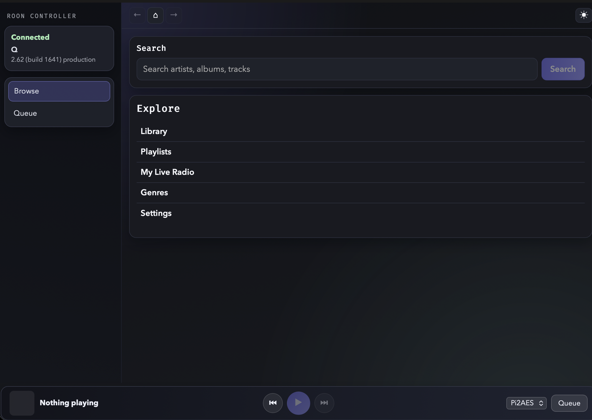
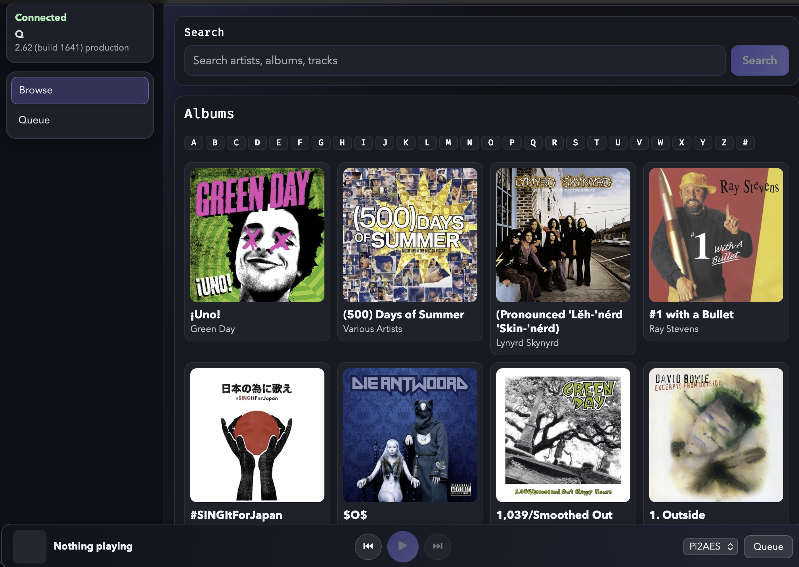
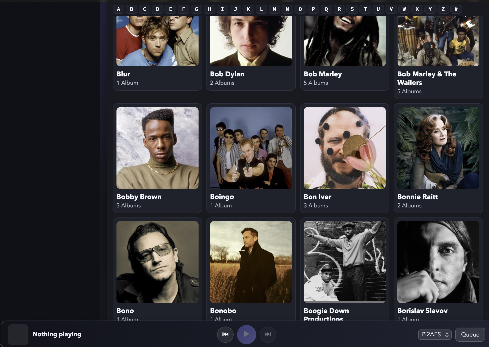
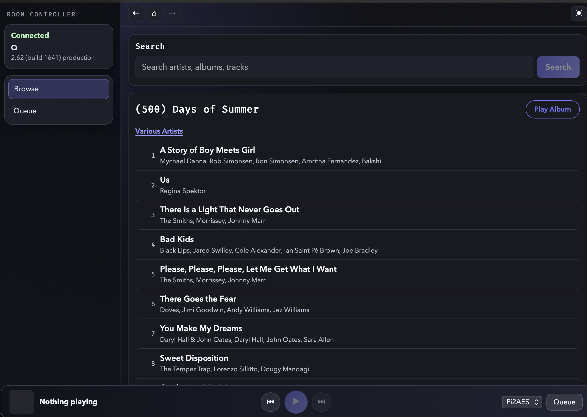
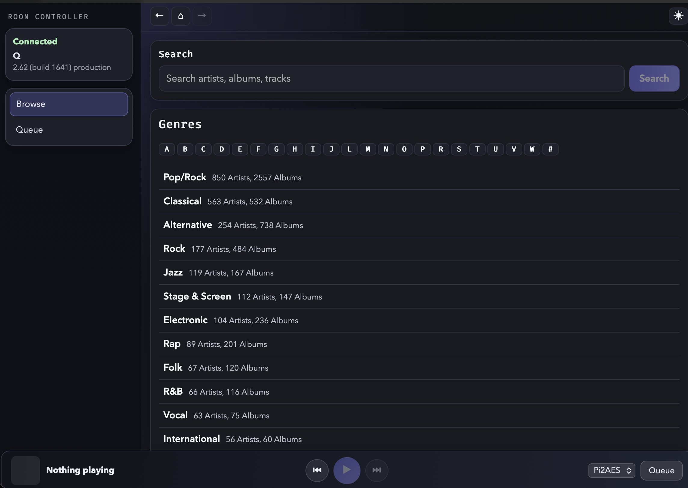
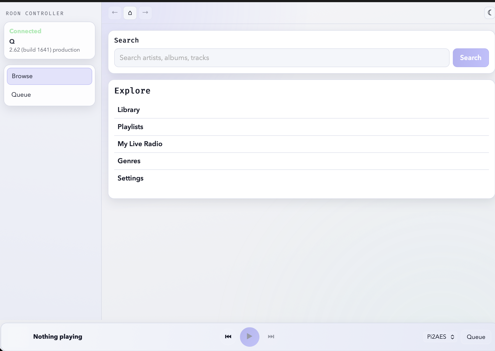

# Roon Controller

Web-based controller for a local Roon Core, built with Node.js + SvelteKit.

## Screenshots

| | |
|---|---|
|  |  |
|  |  |
|  |  |

## What Works

- Browse and search library with alphabetic jump lists, quick-play, and artwork caching
- Real-time zone and now-playing updates via Socket.IO (hydrated on page load)
- Transport controls: play/pause, previous/next, seek, volume
- Queue: per-zone subscription, track listing with artwork, play-from-here, shuffle/loop/auto-radio
- Global zone switching, persistent play bar with track/artist deep-links
- Light/Dark theme with persisted preference

## Queue API Limitation

Roon's public transport API (`node-roon-api-transport`) does not expose remove/reorder endpoints. All currently available queue controls are implemented.

## Tech Stack

- **Backend**: Node.js, TypeScript, Express, Socket.IO
- **Roon**: `node-roon-api`, `node-roon-api-transport`, `node-roon-api-browse`, `node-roon-api-image`
- **Frontend**: SvelteKit (static adapter — no SSR required)
- **Logging**: Pino

## Repository Layout

```
src/       Backend TypeScript source
ui/        SvelteKit frontend (built to ui/build/)
scripts/   Installer scripts (Linux, macOS, Windows)
deploy/    Systemd service template
config/    Roon pairing token (gitignored)
Dockerfile Multi-stage build: backend + frontend → single image/port
```

## Configuration

Copy `.env.example` to `.env` and adjust as needed.

| Variable | Description | Default |
|---|---|---|
| `HOST` | Bind address | `0.0.0.0` |
| `PORT` | HTTP port (serves API + UI) | `3333` |
| `LOG_LEVEL` | Pino log level | `info` |
| `ROON_TOKEN_PATH` | Pairing token path | `./config/roon-token.json` |
| `IMAGE_CACHE_PATH` | Artwork disk cache | `./data/image-cache` |

## Install

Each installer builds from source, deploys to a system directory, and registers a service that starts on boot. Run from the repository root.

### Linux

```bash
sudo ./scripts/install.sh
```

Options: `--port PORT`, `--install-dir DIR` (default: `/opt/roon-controller`), `--user USER` (default: `roon`), `--reinstall`, `--no-start`

### macOS

```bash
sudo ./scripts/install-macos.sh
```

Options: `--port PORT`, `--install-dir DIR` (default: `/opt/roon-controller`), `--reinstall`, `--no-start`

Installs as a launchd daemon. Logs at `/Library/Logs/RoonController/`.

### Windows

Requires [NSSM](https://nssm.cc/) (`winget install nssm` or `choco install nssm`). Run in an elevated PowerShell:

```powershell
.\scripts\install-windows.ps1
```

Options: `-Port`, `-InstallDir` (default: `C:\Program Files\RoonController`), `-Reinstall`, `-NoStart`

### Docker

```bash
docker compose build
docker compose up -d
```

The `./config/` and `./data/` volumes persist the Roon pairing token and artwork cache across restarts.

## Local Development

```bash
./scripts/run-local.sh        # installs deps and starts both servers
```

Or manually:

```bash
npm install && npm run dev                        # backend on :3333
cd ui && npm install && npm run dev -- --host     # frontend on :5173 (proxies /api → :3333)
```

## Validation

```bash
npm run build
npm test -- --runInBand
npm --prefix ui run check
npm --prefix ui run build
```

## Pairing

On first run: Roon → Settings → Extensions → enable **Custom Roon Controller**.

Token is cached at `ROON_TOKEN_PATH` and reconnect is automatic thereafter.
